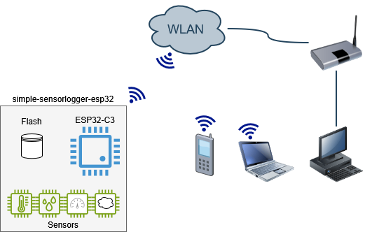
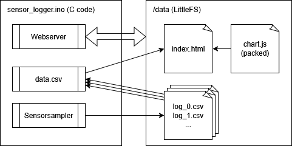
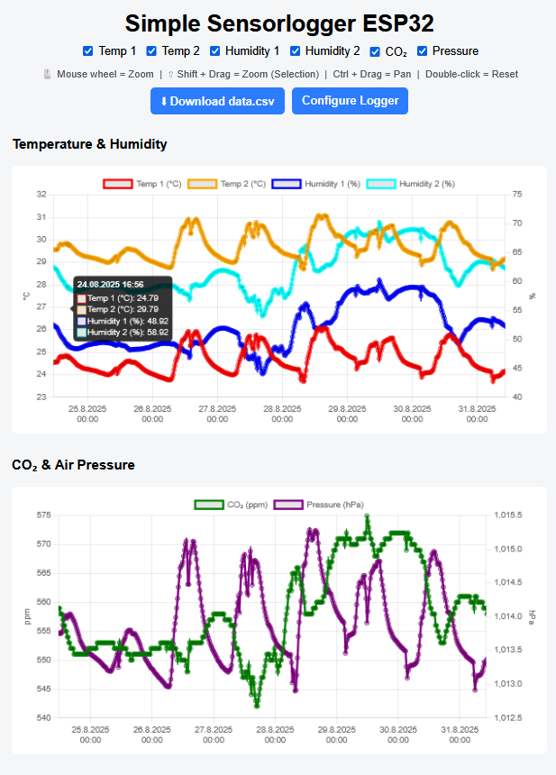
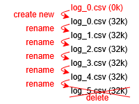
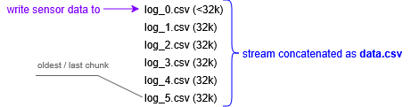
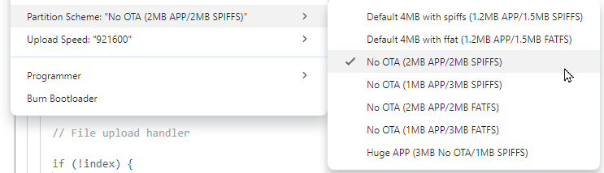

# simple-sensorlogger-esp32
This project logs multiple sensor values to the device’s internal flash memory.
The recorded data can be accessed through the integrated Web UI, where it is displayed as interactive graphs directly served by the device.

The initial concept was based on the ESP8266 platform. However, the hardware was later switched to the LOLIN Pico C3 (ESP32-C3), mainly due to its integrated battery charger, increased RAM capacity, and improved processing performance for running the embedded web server.

The ESP32-C3 also provides deep-sleep capability for low-power operation and offers more resources for handling data processing and visualization tasks efficiently.

## Overview
The device consists of an ESP32 with several sensors connected. This device connects to the WLAN and can be accessed with a PC or smart phone or similar devices.

<p align="center"></p>

The webserver running on the ESP32 serves the files directly from the filesystem (LittleFS). All the files like javascript html and images are ready to use on the filesystem and no active code has to be executed to show the webpage with the sensor data except for the sensor data themselves. Because they are stored in multiple files, a streaming agent concatenas all files and streams it as one big csv file.

On the other hand the sensor sampler samples all the sensors every configured period and stores the data into the log chunkes on the LittleFS.

<p align="center"></p>


The webpage showing a chart of the sensordata with enabled pan and zoom. The data can be hidden/shown using the checkboxes on the top. Check the page [here](https://grafmar.github.io/simple-sensorlogger-esp32/src/sensor_logger/Uncompressed_data/) in a static version with fake data.

<p align="center"></p>


## Hardware
The sensors to be used is not yet defined

## Software
This project is still under construction. At the moment only a random number is logged as a temperature value.

### Log File Handling
Sensor data is stored in rotating log files.
Each log file has a fixed maximum chunk size of 32 kB.

New sensor entries are appended to `log_0.csv`.
Once this file reaches the maximum chunk size, a log rotation is triggered:

- All existing log files are renamed with an incremented index
- The oldest log chunk (highest index) is deleted
- A new `log_0.csv` is created for continued logging

This mechanism ensures constant storage usage while preserving the most recent data. By rotating log files, write operations are distributed across different flash sectors rather than continuously rewriting the same memory area. This reduces flash wear and increases long-term storage reliability.

<p align="center"><br>log rotation</p>

### Web Integration
For seamless integration into the web interface, the web server dynamically concatenates all log files and streams them as a single virtual file named `data.csv`.

This streamed file:
- can be processed directly in JavaScript for visualization
- can be downloaded for external analysis

The physical log files remain separate on the device; data.csv is generated on-the-fly during the request.

<p align="center"><br>log writing and streaming</p>

## Installation
To program the ESP32 for this project you need the following SW and additional libraries and packages:
- Arduino IDE (V2.3.7)
- ESP Async Webserver (3.10.0) by ESP32Async
- Async TCP (3.4.10) by ESP32Async
- Board support package `esp32` by Espressif Systems (V3.3.6)
- LittleFS_esp32 by lorol (1.0.6)

Note:
*Problems may occur with Async webserver if the wrong libraries are used: ESP core 3.x.x is not compatible with the libraries.*


- LittleFS uploader tool [arduino-littlefs-upload](https://github.com/earlephilhower/arduino-littlefs-upload?tab=readme-ov-file):
  - Copy the VSIX file to C:\Users\<username>\.arduinoIDE\plugins\ on Windows (you may need to make this directory yourself beforehand). Restart the IDE.

 tool `esp8266littlefs.jar`:
  - from [arduino-esp8266littlefs-plugin](https://github.com/earlephilhower/arduino-esp8266littlefs-plugin/releases)
  - check [install documentation](https://randomnerdtutorials.com/install-esp8266-nodemcu-littlefs-arduino/#installing)

Open sensor_logger.ino project connect the Wemos D1 R2 mini via USB. Select the right serial port and select the board `LOLIN(WEMOS) D1 R2 & mini`.

Select the right memory segmentation: Tools -> Partition Scheme -> `No OTA (2MB APP/2MB SPIFFS)`



Compile and upload the code to the ESP8266.


To upload the data to the LittleFS you type: `[Ctrl]` + `[Shift]` + `[P]`, then "`Upload LittleFS to Pico/ESP8266/ESP32`". Check that the serial monitor is turned off, otherwise it won't work.

## Speed
Download of 1.5MB data.csv:

```
curl -o NUL http://10.53.182.228/data.csv -w "Total time: %{time_total} seconds\n"
```
It takes **~10.5s** for 1.5MB. But the processing of the data and building of graph in the HTML-page takes some more time. So the load time on my machine is about **14s**.

## Acknowledgements
The idea of this project is based on "Examples/16. Data logging/A-Temperature_logger" of the (https://github.com/tttapa/ESP8266/tree/master) repository. The sensor sampling code and HTML code have been mostly changed and also the chart library has been replaced with chart.js. But that's where the idea and has come from.

Parts of this project were created with the assistance of AI tools
such as ChatGPT and Microsoft Copilot.

## Licence
The project is based on [Examples/16. Data logging/A-Temperature_logger](https://github.com/tttapa/ESP8266/tree/master) which is licenced under GPL v3 and so is this project.

The Javascript libraries chart.js, hammerjs, chartjs-adapter-date-fns and chartjs-plugin-zoom are licenced under MIT licence. These are concatenated into chart_packed.js and than compressed to chart_packed.js.gz.
